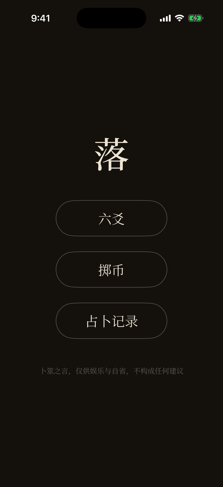
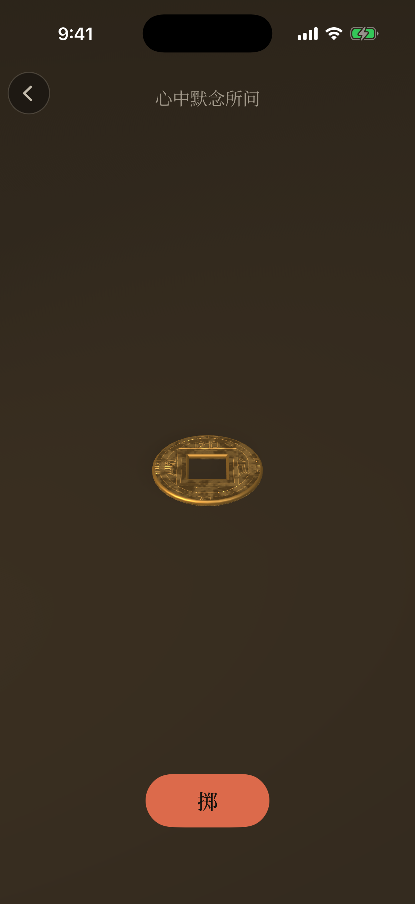
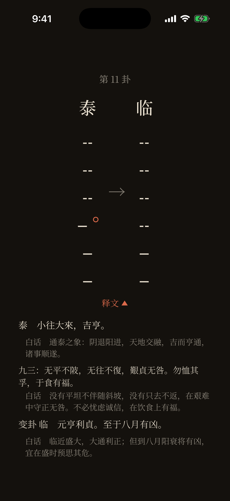

# 落 (Luò)

> 🌐 **中文** · [English](README.en.md)

原生 iOS 卜筮应用 —— 物理级 Ritual(铜钱、六爻,后续 Dice / 塔罗 / 签筒)。设计的单一事实来源(SSOT)在 2nd Brain vault:`Hang/Plans/Divination_App/`(CONTEXT.md + ADR 0001–0009)。

## 视觉身份 —— `DESIGN.md`

视觉系统用 Google 的 [design.md](https://github.com/google-labs-code/design.md) 格式描述(`@google/design.md` —— YAML 设计 token + 散文式理念)。共两个变体,字体/间距/形状完全一致(都从 ADR 推导而来),只在配色上不同:

| 文件 | 变体 | 状态 |
|---|---|---|
| `DESIGN.md` | **Dusk Desk(暮案)** —— 暖近黑桌面、旧纸墨字、唯一朱砂强调色 | **当前默认**(与暗色 SceneKit 场景一致) |
| `DESIGN-paper.md` | **Rice Paper(宣纸)** —— 暖宣纸米白、研磨墨字、深朱砂印 | 备选,parked |

暗/浅之选**有意推迟到 Phase 2**(真机、上手判断)。两份都干净通过 `npx @google/design.md lint <file>`。改任何 token 前先用 lint CLI 校验。中文阅读版:`DESIGN.zh.md` / `DESIGN-paper.zh.md`(token 以英文版为准)。

## 当前状态 —— v1 主线可用

Coin + 六爻两个 Ritual 全流程已在模拟器上跑通:物理掷币 → 六爻累积 → 本卦/变爻 → 变卦 → 释文(周易原文 + 白话对照) → 占卜记录持久化。待办与路线图以 [GitHub Issues](https://github.com/charliezong18/luo/issues) 为准。

<p align="center">
  &nbsp;&nbsp;
  &nbsp;&nbsp;
  
</p>

- **物理级掷币** —— SceneKit/PhysX 真实刚体,方孔圆钱 + PBR 古铜材质;摇一摇触发完整投掷(保证公平,不走捷径)
- **六爻三钱法** —— 掷 6×3 币累积成卦,动爻朱砂标记,本卦→变卦并排呈现
- **释文层** —— 全 64 卦卦辞 + 384 爻辞(通行本轻标点,字源 ctext.org 阮元本古经),白话对照可开合
- **占卜记录** —— SwiftData 本地存档,可补记所问与笔记;app 完全离线、零采集
- **视觉** —— Dusk Desk 暖黑桌面 + 内置 Noto Serif SC,唯一朱砂强调色

真机调校与 App Store 上架推进中(#3 / #4)。

## 配置 —— XcodeGen

Xcode 工程由 `project.yml` 经 [XcodeGen](https://github.com/yonaskolb/XcodeGen) 生成 —— 不手工提交 `.xcodeproj`,随时可重新生成。源码在 `Luo/`。

```bash
brew install xcodegen        # 一次性(Mac mini 上已装)
cd ~/Developer/luo
xcodegen generate            # 由 project.yml 生成 Luo.xcodeproj
open Luo.xcodeproj           # 然后 ⌘R
```

命令行构建 + 验证(无签名,模拟器):

```bash
xcodebuild -project Luo.xcodeproj -scheme Luo \
  -sdk iphonesimulator -destination 'generic/platform=iOS Simulator' \
  build CODE_SIGNING_ALLOWED=NO
```

- 最低部署 **iOS 17**(Phase 2 起需 iPhone 15+,见 ADR-0007);`TARGETED_DEVICE_FAMILY=1`(仅 iPhone)。
- **模拟器**能看到画面 + Throw 按钮,但触觉静默、CoreMotion 摇晃很弱 —— 真机调校是 Phase 2。
- **真机**:在 `project.yml`(或 Xcode → Signing)里把 `DEVELOPMENT_TEAM` 设成你的 Apple ID team,`xcodegen generate`,运行。

## Phase 2 调校循环

跑在真机上之后,循环是:
1. Throw → 看 + 感受。
2. 一次只调一个滑块。
3. 再 Throw。
4. 重复,直到 Settle 读起来"像那张桌子"。
5. 记下收敛值;它们成为 v1 里 `PhysicsScene` 的常数。

## License —— source-available,非开源

代码公开是为了可读、可学习,**不是开源**:不授予再分发、上架(App Store 或其他渠道)或任何商业使用的权利,详见 [LICENSE](LICENSE)。

白话解卦语料是专有内容,repo 里只有加密后的 `Luo/Resources/BaiHua.enc`(密钥不公开)。没有密钥也能正常编译运行,解卦界面会优雅降级为只显示周易原文。
